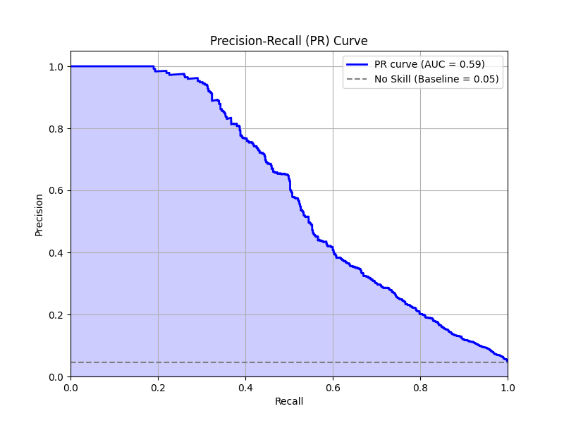
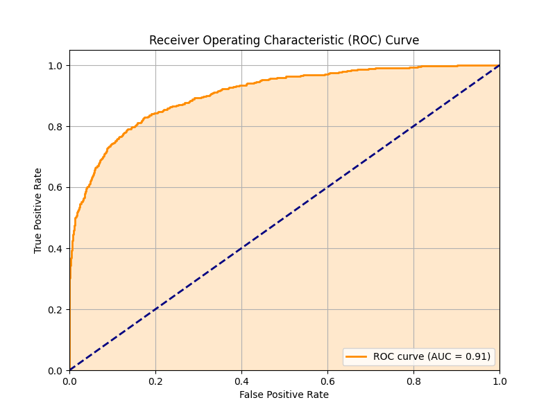
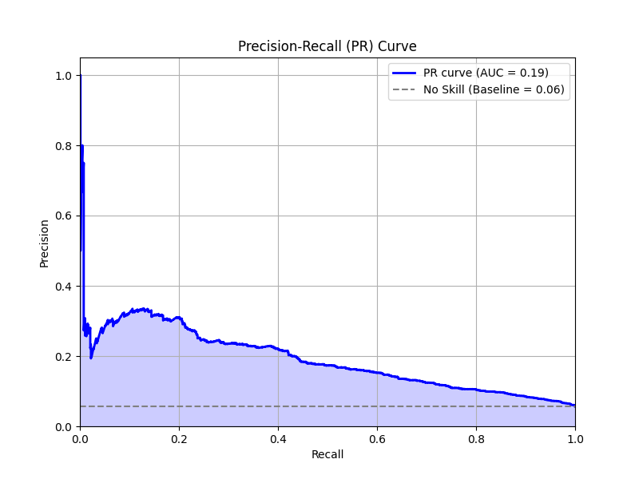
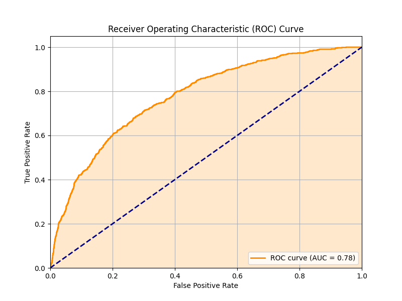

# Breast Cancer Driver Mutation Prediction using PCSA and XGBoost as a Meta-Learner
GenoXplain is a solution for the interpretable analysis of genetic variants and their impact on cancer signaling pathways. Users can upload their genetic variant data (e.g., VCF files) or paste variants directly to receive insights into how these variations may affect cancer-related biological processes. This tool aims to bridge the gap between raw genetic data and actionable understanding for researchers and clinicians in the field of oncology.

# Objective
In the long run, GenoXplain aims to accurately predict cancer driver mutations from genetic variant data, providing interpretable insights into their potential impact on cancer signaling pathways. This project specifically evaluates the performance of an XGBoost meta-learner model, using Pathogenic and Conservation Scoring Algorithms (PCSA), for identifying these driver mutations under different gene evaluation scenarios and explain the model decision.

# Dataset
- Patient Data (Source: cBioPortal)
- 3D Protein Data (Source: AlphaFold Protein Structure Database)
- dbNSP : Precomputed PCSAs scores (Source: MyVariant.info)
- 299 driver genes: based on the catalog of driver genes identified by Bailey et al. (2018).

# Model Training: XGBoost as a Meta-Learner

* **XGBoost**: A supervised learning algorithm implementing a gradient boosting framework. It sequentially builds an ensemble of decision trees, optimizing for performance and regularization.
* **Meta-Learner**: In this context, XGBoost functions as a meta-learner by utilizing features derived from other sources or processes (e.g., precomputed PCSA scores) as input to make its final predictions, effectively learning from a transformed feature space.

### Explanation with LIME

* **LIME (Local Interpretable Model-agnostic Explanations)**: A technique that provides explanations for individual predictions of any black-box machine learning model. It achieves this by learning a simpler, interpretable model (e.g., linear regression) locally around the specific instance being predicted, thus approximating the behavior of the complex model in that vicinity.

## Evaluation with Intermixed Genes in Train/Test Sets
This evaluation scenario assesses the model's performance when known driver genes are randomly distributed between the training and testing datasets. This setup tests the model's ability to identify driver mutations within a familiar gene pool.

## R&D Scope: Assessing Generalization to Novel Genes

This research and development scope evaluates the model's generalization capabilities to new, unseen genes. The 299 known driver genes are split; one subset is used exclusively for training, and the other distinct subset is used for testing. This is a more challenging scenario, reflecting a real-world application where the model might encounter genes it wasn't explicitly trained on.

# Results

## Evaluation with Intermixed Genes in Train/Test Sets

**Precision-Recall (PR) Curve:**

  

The PR curve for this scenario shows an Area Under the Curve (AUC) of **0.59**. This value indicates the model's ability to distinguish between driver and non-driver mutations. The curve is well above the "No Skill" baseline of 0.05, suggesting that the model has learned a meaningful signal. The precision starts high and decreases as recall increases, which is typical. A PR-AUC of 0.59 demonstrates a good, but not perfect, trade-off between precision (the proportion of predicted driver mutations that are actual drivers) and recall (the proportion of actual driver mutations that are correctly identified).

**Receiver Operating Characteristic (ROC) Curve:**

  

The ROC curve displays an Area Under the Curve (AUC) of **0.91**. This is a strong result, indicating a high capability of the model to differentiate between positive (driver) and negative (non-driver) classes. An AUC of 0.91 means there is a 91% chance that the model will rank a randomly chosen positive instance higher than a randomly chosen negative one. The curve is significantly above the diagonal dashed line (which represents a random classifier), highlighting good performance in terms of balancing the true positive rate and false positive rate.

## R&D Scope: Assessing Generalization to Novel Genes

**Precision-Recall (PR) Curve:**

  

In this more challenging scenario focusing on unknown genes, the PR curve shows an Area Under the Curve (AUC) of **0.19**. While this is lower than the previous scenario, it is still above the "No Skill" baseline of 0.06. This suggests that predicting driver mutations in entirely new genes is significantly harder. The model still shows some ability to enrich for true positives, but the precision-recall trade-off is less favorable. This indicates that while the model has learned some generalizable features, its performance drops when faced with genes it has not seen during training.

**Receiver Operating Characteristic (ROC) Curve:**

  

The ROC curve for the gene-split scenario has an Area Under the Curve (AUC) of **0.78**. This is a decrease compared to the 0.91 AUC in the first scenario but still indicates a reasonably good discriminative ability. An AUC of 0.78 means the model is still considerably better than a random classifier at distinguishing driver mutations in unknown genes. The drop in ROC-AUC from 0.91 to 0.78 highlights the difficulty of generalizing to new genes and suggests that gene-specific features might play a significant role that the model struggles to capture when genes are strictly separated between training and testing.
